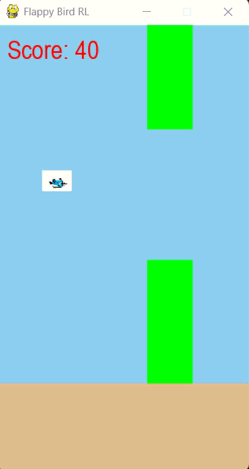
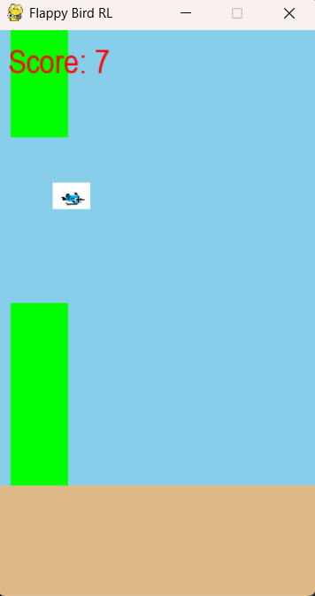
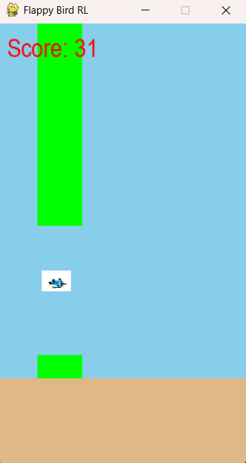

🕹️ Flappy Bird with AI Agent using Reinforcement Learning

An AI-powered version of the classic Flappy Bird game built using Reinforcement Learning (PPO algorithm).
The agent learns to play the game by trial and error — improving its performance with every failure!

🚀 Demo

Watch the AI agent play Flappy Bird 👇

📁 Repository Structure

flappy_bird/

│

├── flappy.py              # Game environment (FlappyBirdEnv)

├── train_agent.py         # Script to train the AI agent

├── play_agent.py          # Script to load and play the trained model

├── bird.png               # Bird sprite image

├── requirements.txt       # Required Python packages

├── .gitignore             # Ignored files/folders

│

├── models/

│   └── flappybird_ppo.zip # Saved trained PPO model

│

└── media/
    ├── gameplay.gif       # Demo GIF
    ├── screenshot1.png
    └── screenshot2.png

🧠 About the Project

This project demonstrates how Reinforcement Learning can be used to teach an AI to play a dynamic game environment.
Using Stable-Baselines3’s PPO (Proximal Policy Optimization) algorithm, the AI learns the optimal strategy to pass through pipes without crashing.

🧩 Technologies Used

| Component            | Library / Tool          |
| -------------------- | ----------------------- |
| Programming Language | Python 3.11             |
| Environment          | Gymnasium / Pygame      |
| RL Algorithm         | Stable-Baselines3 (PPO) |
| Visualization        | Pygame                  |
| Model Storage        | `.zip` model file       |

⚙️ Installation

Clone this repository:

git clone https://github.com/Aswinx05/flappy_bird.git
cd flappy_bird

Install dependencies:

pip install -r requirements.txt

🏋️‍♂️ Train the AI Agent

Run the following command to start training:

python train_agent.py

This will train the AI using PPO for 100,000 timesteps and save the model inside the models/ folder.

🎮 Play the Trained Agent

Once the training is complete, run:

python play_agent.py

The agent will now play the game autonomously — and you’ll see its score on screen!

🧾 Features

✅ Animated gameplay using Pygame
✅ Real-time score display
✅ AI agent learns and improves after each failure
✅ Fully automated restart on bird death
✅ Reproducible and extendable code structure

🚀 Demo

Watch the AI agent play Flappy Bird 👇

  

📸 Screenshots

   

📊 Results and Performance

After several training iterations, the PPO agent learns to survive longer and score consistently above 20+.
You can visualize the improvement using logs generated by Stable-Baselines3.
The AI starts by random actions and gradually learns the timing of jumps.

🧑‍💻 Author

Aswin Ananth S
🎓 Mini Project — Flappy Bird with AI Agent using Reinforcement Learning
📂 GitHub Repository - https://github.com/Aswinx05/flappy_bird.git

📜 License

This project is open source under the MIT License — feel free to use and modify with credit.

